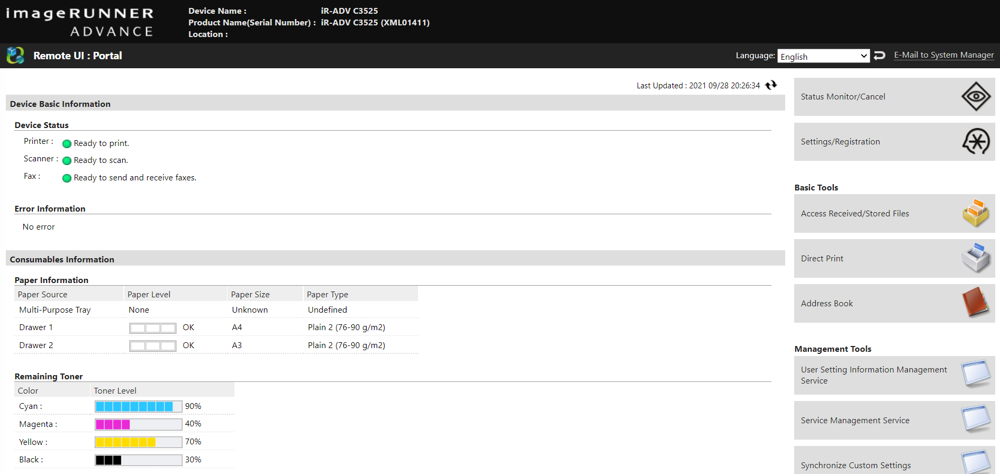
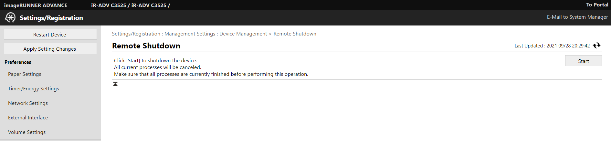

 
# CVE-2021-41822（水的一个） 
# Canon printer unauthorized access vulnerability and denial of service vulnerability

The attacker does not need an account or password to access the printer page and obtain information about printed files. And the printer can be turned off remotely. Create denial of service vulnerabilities.

Impact product imageRUNNER ADVANCE IR-ADV C3525

## CVE-2021-41822
